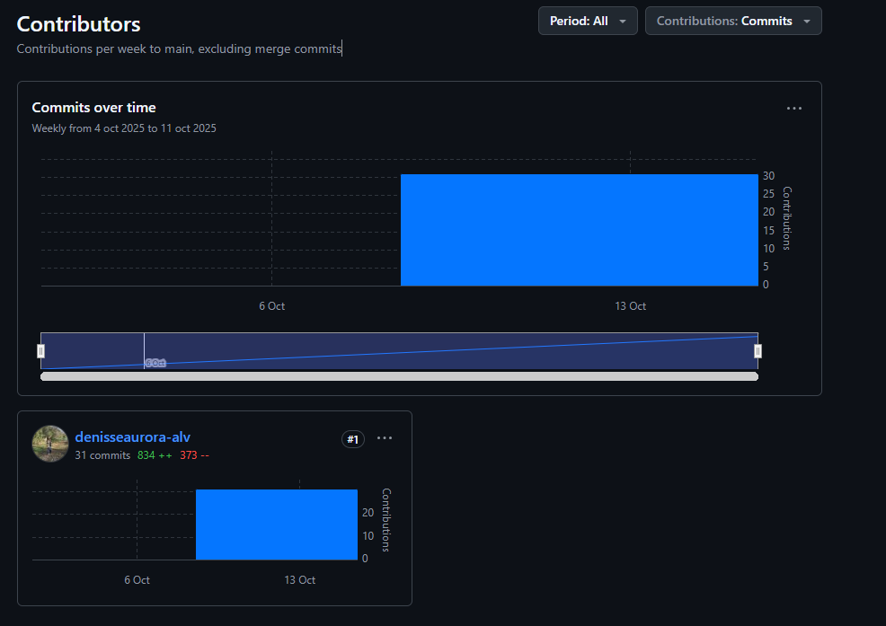

# PIA-Estadística
## Maestría en Ciencias Forestales | Experimentación y Métodos Estadísticos
##### Estudiante: Denisse Aurora Alvarado Reyna
##### Matrícula: 1913135
## Índice de tareas
- **HW01** - Laboratorio 1 Empezar con R y RStudio
- **HW02** - Contraste de Medias
- **HW3** - Ejercicio ANOVA
### Contribuidores
 
Para ver estadísticas detalladas de las contribuciones (https://github.com/denisseaurora-alv/PIA-Estad-stica/graphs/contributors)

